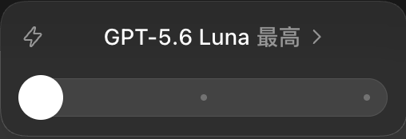

# Codex Model Slider · Codex 三档模型滑块

**双击一个脚本，把 Codex 原生滑块改成常用的三组「模型 + 推理强度」。**

Luna Max → Sol High → Astra Medium。适用于 macOS，无需修改应用包或安装插件。

[English](README.en.md) · [为什么选择这三档](https://github.com/cabbagecabbage/chatgpt-plus-codex-cn-guide/blob/main/docs/model-selection-and-reasoning.md)

## 快速使用

1. 点击本页 **Code → Download ZIP**，解压到任意目录。
2. 先结束 Codex 中正在进行的任务，然后双击 **[三档滑块.command](三档滑块.command)**。
3. 等待应用重新打开，终端显示 **「三档已加载」** 后，就可以拖动原生滑块切换。

以后想使用这三档，也通过这个脚本启动。可以把脚本放到桌面，方便双击。

**运行条件：** macOS，应用安装在 `/Applications/ChatGPT.app`；优先使用应用自带的 Node.js，没有时需要已安装的 Node.js 22+；账号需要本来就能使用对应模型和强度。脚本不会解锁模型或增加额度。

如果 Codex 正在运行，脚本会先等待 5 秒，期间可以按 Ctrl+C 取消，再请求正常退出并重启。若自动退出失败，按提示切回 Codex，按 ⌘Q。

### 三档效果

| Luna Max | Sol High | Astra Medium |
| :---: | :---: | :---: |
|  |  |  |
| 日常简单任务 | 目标明确的工程开发 | 方案、架构与设计讨论 |

截图展示已有界面效果；实际可用模型以你的账号和应用版本为准。

### 打不开或没有生效？

- **提示没有执行权限：** 打开终端，输入 `chmod +x `（末尾留一个空格），把解压后的 `.command` 文件拖进去，按回车，再双击文件。
- **macOS 拦截：** 确认文件来自本仓库并阅读脚本后，按系统提示到「系统设置 → 隐私与安全性」允许打开，不必关闭系统安全保护。
- **请求自动化权限：** 首次运行可能需要允许终端控制 Codex，以便正常退出应用。
- **仍只显示一个模型的推理强度：** 尝试在原选择器中点击「重置为默认」，再检查模型名称。
- **找不到 Node.js：** 安装 Node.js 22+ 后重试；脚本不会自动安装依赖。
- **显示加载失败：** 当前应用内部接口可能已变化。完全退出后正常打开应用即可恢复使用；不要反复重启正在执行任务的应用。

## 为什么做这个项目？

实际使用 Codex 时，常切换的是几组固定搭配：简单任务选一个，明确的开发任务选一个，需要讨论方案时再选一个。每次分别选择模型和推理强度，会多出重复操作。

这个小工具把常用组合直接放进原生滑块：拖动一次，同时选好模型和推理强度。保持一个脚本、双击启动，尽量减少配置步骤。

## 为什么是这三档？

这套默认值来自个人使用习惯，主要在额度、完成任务的等待时间和判断力之间取舍：

| 默认组合 | 更常用的场景 | 选择理由（个人体验） |
| --- | --- | --- |
| **Luna Max** | 简单需求、日常任务，不急着拿结果 | 更看重节省额度，可以接受等待 |
| **Sol High** | 需求明确、能用测试和验收判断结果的工程开发 | 更看重实现能力和推进速度 |
| **Astra Medium** | 方案、机制、架构与 Skill 设计 | 更看重理解意图、权衡方案和减少返工 |

可以按任务直接选档，不需要从左到右逐级尝试。三档也不是统一的速度、价格或能力刻度。

完整背景见配套指南中的 **[《Codex 模型与推理强度选择详细分析》](https://github.com/cabbagecabbage/chatgpt-plus-codex-cn-guide/blob/main/docs/model-selection-and-reasoning.md)**。其中当前三档的理由是个人使用观察，历史评测与成本分析有单独的适用范围，不能当作这三档的严格对照实验或订阅额度保证。

## 如何自定义？

用文本编辑器打开 `三档滑块.command`，找到开头的 `presets`，改成账号支持的三个组合，然后重新运行：

```js
const presets=[
  {model:'gpt-5.6-luna',reasoning_effort:'max'},
  {model:'gpt-5.6-sol',reasoning_effort:'high'},
  {model:'gpt-6-astra',reasoning_effort:'medium'},
];
```

模型 ID 和推理强度必须匹配账号及客户端实际支持的值。终端成功提示中的三档名称是固定文字，自定义时也可以同步修改。

## 原理与恢复

脚本用临时调试端口启动官方应用，通过 Chromium DevTools Protocol（CDP）连接 `app://-/` 界面，在内存中包装 Statsig 客户端的 `getDynamicConfig`，只替换配置 `423260384` 的 `presets`，再发送 `values_updated` 通知界面刷新。滑块的模型切换、参数保存和可用性判断仍由应用原有代码处理。

它不修改 ASAR、Info.plist、应用源码或签名，也不写入持久预设文件。页面刷新或应用退出后，内存覆盖就会消失。

**恢复原生滑块：完全退出应用，再从 Dock 正常打开。** 已经选定的模型可能仍由应用自身保存；恢复滑块不等于清空会话设置。

## 兼容性与边界

- 这是非官方工具，依赖应用内部接口，没有官方兼容性承诺。应用更新后可能失效，当前未提供版本、签名或归档指纹校验，也不自动适配。
- 调试端口按本机地址 `127.0.0.1` 启动，在该次应用运行期间保持开启并具有页面执行能力；不要转发端口或交给不可信程序，完全退出应用后关闭。
- 脚本不要求 API key，不读取聊天内容、不保存诊断日志或会话文件；应用自身仍会正常联网。
- 本次整理保留原脚本逻辑，只调整文件执行权限与文档。已完成静态语法检查；没有为这次整理重启应用或重新做实机验收。

## 配套阅读

**[ChatGPT Plus 国内订阅与 Codex 使用指南](https://github.com/cabbagecabbage/chatgpt-plus-codex-cn-guide)**：订阅、配置和模型选择的完整背景。本项目专注于把常用组合放进滑块，详细选择依据在指南中维护。

官方模型参数参考：[GPT-6 Astra](https://developers.openai.com/api/docs/models/gpt-6-astra)。官方 API 文档不代表这个客户端内部接口受支持，也不保证某个账号可用。

## 许可

项目代码与文档采用 [MIT License](LICENSE)。截图中的产品界面和商标归其各自权利人所有。本项目与 OpenAI 无隶属或背书关系。
