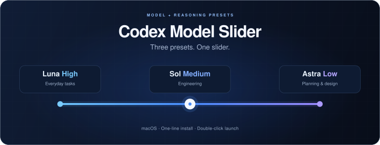

<p align="center">
  
</p>

<h1 align="center">Codex Model Slider · 三档模型滑块</h1>

<p align="center"><strong>把常用的「模型 + 推理强度」放进 Codex 原生滑块。</strong></p>

<p align="center">
  
  <a href="LICENSE"></a>
  
</p>

[English](README.md) · **简体中文** · [一行安装](#快速使用) · [三档怎么选](#为什么是这三档)

| 拖一下，就切换 | 双击，就启动 | 环境，自动准备 |
| :--- | :--- | :--- |
| 一次选好模型与推理强度 | 一行安装到桌面，以后双击使用 | 自动检测 Node.js，缺失时下载并校验 |

此 fork 使用 Keaton 选择的 GPT-6 组合。原项目：[cabbagecabbage/codex-model-slider](https://github.com/cabbagecabbage/codex-model-slider)。

## 实际效果

| Luna High | Sol Medium | Astra Low |
| :---: | :---: | :---: |
| GPT-6 Luna · high | GPT-6 Sol · medium | GPT-6 Astra · low |

## 快速使用

打开 macOS「终端」，复制下面这一行并按回车：

```bash
(set -o pipefail; curl -fsSL https://raw.githubusercontent.com/Keaton-tv/better-codex/main/install.sh | /bin/bash)
```

桌面会出现 **「Codex-Model-Slider.command」** 和一个隐藏的缓存辅助文件。先结束 Codex 中正在进行的任务，再双击启动脚本；等终端显示 **「三档已加载」**，就可以拖动原生滑块切换了。以后只需双击桌面的文件。安装与运行提示均为中英双语。

**运行条件：** macOS，应用安装在 `/Applications/ChatGPT.app`；Node.js 会自动检查并准备，无需手动安装；账号需要本来就能使用对应模型和强度。脚本不会解锁模型或增加额度。

<details>
<summary><strong>手动下载与启动说明</strong></summary>

也可以点击 **Code → Download ZIP**，解压后在同一目录保留 [Codex-Model-Slider.command](Codex-Model-Slider.command) 和 [cache-indicator.mjs](cache-indicator.mjs)，再双击启动脚本。如果想把它安装到桌面，在终端输入 `bash `，拖入解压目录里的 `install.sh`，再输入 ` --local` 并回车。

安装命令下载启动脚本和只读缓存辅助文件，不会启动或退出应用，也不需要 `sudo`。桌面已有同名文件时会停止；更新时先把旧文件移走，再运行命令。你可以先[查看安装脚本](install.sh)。

如果 Codex 正在运行，脚本会先等待 5 秒，期间可以按 Ctrl+C 取消，再请求正常退出并重启。若自动退出失败，按提示切回 Codex，按 ⌘Q。

</details>

## 输入框旁边的缓存与每周用量

通过桌面启动脚本打开应用后，本地任务的上下文指示器旁边会显示类似 `Cache ~29m` 的估计值。辅助程序读取本地任务记录中的缓存 token 数。显示问号表示没有近期确认的缓存读取或写入，或者 30 分钟的最低缓存期限已经过去。下一次真实请求才能确认缓存是否复用。辅助程序不会发送保温消息。灵感来自 [CodexZero 的缓存指示器](https://github.com/Retro2512/CodexZero)。

旁边还会显示类似 `◷ 68% left` 的每周 Codex 剩余额度，每两分钟通过应用自带的 Codex 服务更新一次。鼠标悬停可查看重置时间；若服务没有提供每周额度，则不显示此项。

## 为什么做这个项目？

实际使用 Codex 时，常切换的是几组固定搭配：简单任务选一个，明确的开发任务选一个，需要讨论方案时再选一个。每次分别选择模型和推理强度，会多出重复操作。

这个小工具把常用组合直接放进原生滑块：拖动一次，同时选好模型和推理强度。保持一个脚本、双击启动，尽量减少配置步骤。

## 为什么是这三档？

这个 fork 使用以下三档：

| 默认组合 | 更常用的场景 | 选择理由（个人体验） |
| --- | --- | --- |
| **Luna High** | 范围明确的任务 | 更低的额度消耗 |
| **Sol Medium** | 日常工作 | 平衡速度与深度 |
| **Astra Low** | 更复杂的工作 | 更强的模型，较轻的推理强度 |

可以按任务直接选档，不需要从左到右逐级尝试。三档也不是统一的速度、价格或能力刻度。以上是个人体验，未经严格对照测试，不保证特定的效果或额度消耗。


## 按需了解更多

<details>
<summary><strong>自定义三档</strong></summary>

用文本编辑器打开 `Codex-Model-Slider.command`，找到开头的 `presets`，改成账号支持的三个组合，然后重新运行：

```js
const presets=[
  {model:'gpt-6-luna',reasoning_effort:'high'},
  {model:'gpt-6-sol',reasoning_effort:'medium'},
  {model:'gpt-6-astra',reasoning_effort:'low'},
];
```

模型 ID 和推理强度必须匹配账号及客户端实际支持的值。终端成功提示中的三档名称是固定文字，自定义时也可以同步修改。

</details>

<details>
<summary><strong>运行原理与恢复默认</strong></summary>

脚本用临时调试端口启动官方应用，通过 Chromium DevTools Protocol（CDP）连接 `app://-/` 界面，在内存中包装 Statsig 客户端的 `getDynamicConfig`，只替换配置 `423260384` 的 `presets`，再发送 `values_updated` 通知界面刷新。滑块的模型切换、参数保存和可用性判断仍由应用原有代码处理。

它不修改 ASAR、Info.plist、应用源码或签名，也不写入持久预设文件。页面刷新或应用退出后，内存覆盖就会消失。

**恢复原生滑块：完全退出应用，再从 Dock 正常打开。** 已经选定的模型可能仍由应用自身保存；恢复滑块不等于清空会话设置。

</details>

<details>
<summary><strong>自动下载、文件位置与卸载</strong></summary>

1. **安装到桌面：** 一行安装命令从本仓库下载启动脚本，设置执行权限；不启动应用，不覆盖桌面已有的同名文件。
2. **双击后准备环境：** 检查固定应用路径和可用的 Node.js。只有缺少兼容运行环境时才下载。
3. **环境就绪后启动：** 按原逻辑正常退出并重启应用，加载三档滑块；有任务未完成时可在退出前的 5 秒内取消。

首次双击时，脚本会优先使用应用自带或本机已有的兼容 Node.js；都不可用时，自动从 [Node.js 官方站点](https://nodejs.org/dist/v22.23.2/) 下载匹配 Apple Silicon / Intel 的 Node.js 22.23.2，校验 SHA-256 后保存到 `~/Library/Application Support/Codex Model Slider`，以后直接复用。无需 Homebrew、管理员密码或手动配置 PATH，也不会替换系统已有的 Node.js。首次下载需要网络，系统授权提示按需确认即可。

官方安装包的 SHA-256 校验值固定在脚本中，校验通过后才解压和使用。下载或校验失败会清理临时文件并停止，应用不会被重启；下次双击会重试。下载的运行环境只供本工具使用，官方许可证会一并保存。

**清理：** 删除桌面的 `Codex-Model-Slider.command` 和 `~/Desktop/.Codex-Cache-Indicator.mjs`。如果曾自动下载 Node.js，还可在 Finder「前往文件夹」中输入 `~/Library/Application Support/Codex Model Slider`，删除这个工具专用目录。不要删除你已有的其他 Node.js 安装。恢复原生滑块只需完全退出应用后正常打开。

</details>

<details>
<summary><strong>排查问题</strong></summary>

- **提示没有执行权限：** 打开终端，输入 `chmod +x `（末尾留一个空格），把解压后的 `.command` 文件拖进去，按回车，再双击文件。
- **macOS 拦截：** 确认文件来自本仓库并阅读脚本后，按系统提示到「系统设置 → 隐私与安全性」允许打开，不必关闭系统安全保护。
- **请求自动化权限：** 首次运行可能需要允许终端控制 Codex，以便正常退出应用。
- **仍只显示一个模型的推理强度：** 尝试在原选择器中点击「重置为默认」，再检查模型名称。
- **Node.js 下载失败：** 检查网络后重新双击即可。准备失败时不会退出或启动应用。
- **显示加载失败：** 当前应用内部接口可能已变化。完全退出后正常打开应用即可恢复使用；不要反复重启正在执行任务的应用。

</details>

## 兼容性与边界

- 这是非官方工具，依赖应用内部接口，没有官方兼容性承诺。应用更新后可能失效，当前未提供版本、签名或归档指纹校验，也不自动适配。
- 调试端口按本机地址 `127.0.0.1` 启动，在该次应用运行期间保持开启并具有页面执行能力；不要转发端口或交给不可信程序，完全退出应用后关闭。
- 脚本不要求 API key，会读取本地任务记录以获取缓存 token 数，并通过应用自带的 Codex 服务读取每周用量百分比；不显示或发送聊天内容，也不保存诊断日志或会话文件。应用自身仍会正常联网。
- 保留原脚本的应用名称、路径和滑块行为，增加桌面安装、Node.js 自动准备及中英双语提示。已完成语法检查、隔离安装和运行环境准备测试；未重新进行应用重启或界面验收。

<details>
<summary><strong>配套阅读与官方参考</strong></summary>

**[ChatGPT Plus 国内订阅与 Codex 使用指南](https://github.com/cabbagecabbage/chatgpt-plus-codex-cn-guide)**：订阅、配置和模型选择的完整背景。本项目专注于把常用组合放进滑块，详细选择依据在指南中维护。

官方模型参数参考：[GPT-6 Astra](https://developers.openai.com/api/docs/models/gpt-6-astra)。官方 API 文档不代表这个客户端内部接口受支持，也不保证某个账号可用。

</details>

---

项目代码与文档采用 [MIT License](LICENSE)。截图中的产品界面和商标归其各自权利人所有。本项目与 OpenAI 无隶属或背书关系。
